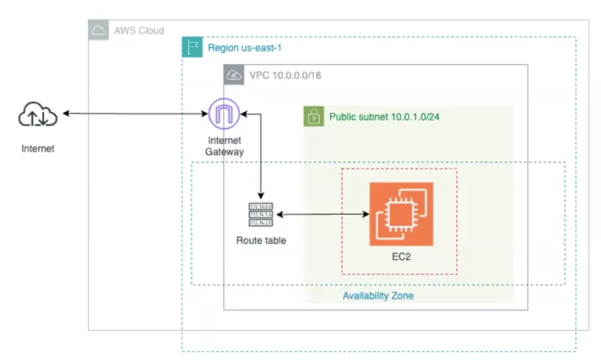

# Automated AWS Infrastructure with Terraform

A company needs to provision a secure and scalable AWS environment for public-facing workloads. The goal is to automate the creation of a network and compute resources using Terraform, following best practices and clear requirements.

## Architecture Overview

The solution provisions the following AWS resources:

- **Custom VPC** with a defined CIDR block
- **Public Subnet** associated with the VPC
- **Internet Gateway** attached to the VPC for outbound/inbound internet access
- **Route Table** with a route to the Internet Gateway, associated with the public subnet
- **Security Group** allowing inbound SSH (port 22) and all outbound traffic
- **EC2 Instance** (t2.micro) launched in the public subnet
- **S3 Bucket** (to be created manually) for storing the Terraform backend state

Below is the architecture diagram for reference:



## Definition of Done (DoD)

This solution fulfills the following requirements:

- A custom VPC is created with its own CIDR block.
- At least one public subnet is defined and associated with the VPC.
- A public route table is configured with a route to the Internet Gateway.
- An Internet Gateway is implemented and attached to the VPC.
- A Security Group is created to allow SSH traffic (port 22).
- An EC2 instance (t2.micro) is launched in the public subnet.
- An existing SSH key can be used for access, or it is documented if omitted for simplicity.

## Prerequisites

- Terraform installed
- AWS CLI configured
- LocalStack for local AWS emulation

## Quick Start

1. Start LocalStack:
   ```bash
   localstack start -d
   ```

2. Set environment variables:
   ```bash
   export AWS_ENDPOINT_URL=http://localhost:4566
   export AWS_ENDPOINT_URL_S3=http://s3.localhost.localstack.cloud:4566
   export AWS_ACCESS_KEY_ID=test
   export AWS_SECRET_ACCESS_KEY=test
   export AWS_DEFAULT_REGION=us-east-1
   ```

3. Initialize Terraform:
   ```bash
   terraform init
   ```

4. Apply the configuration:
   ```bash
   terraform apply
   ```

> **Note:** Manually create the S3 bucket for the Terraform backend before running `terraform apply`.

---

This repository demonstrates a practical solution for automated AWS infrastructure provisioning using Terraform, aligned with typical business requirements and cloud best practices.
